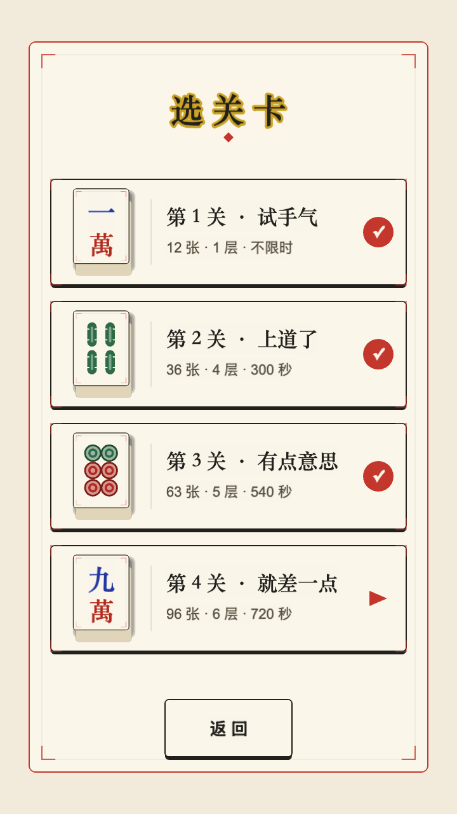
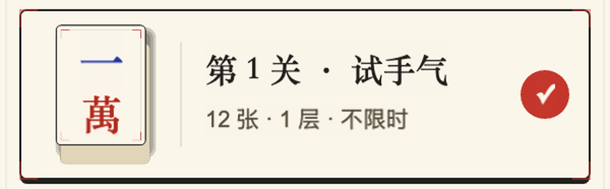
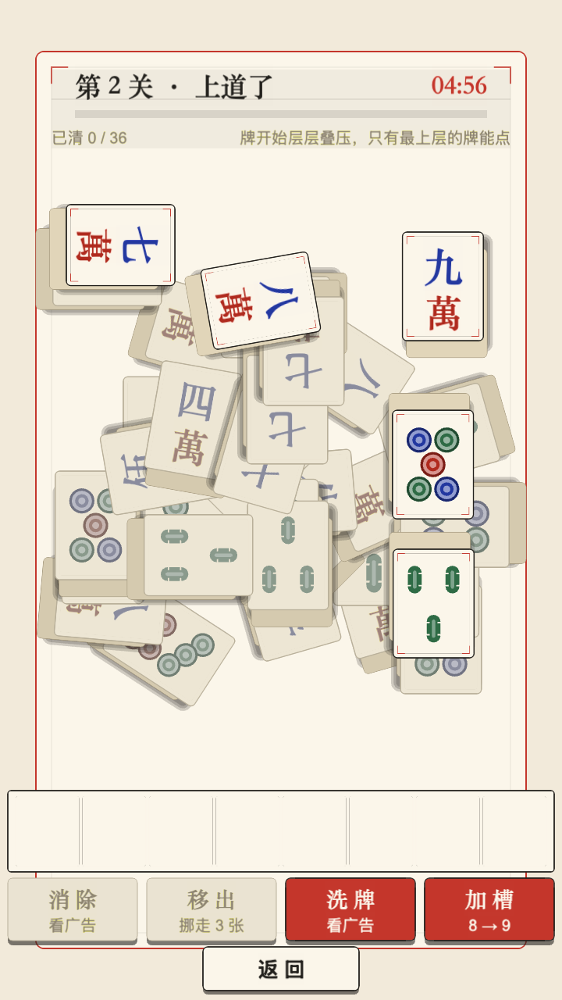
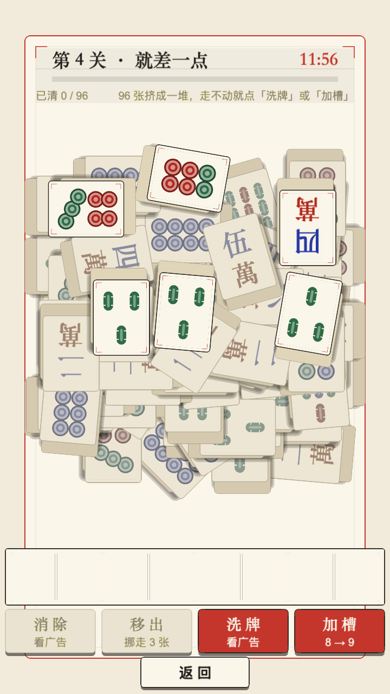
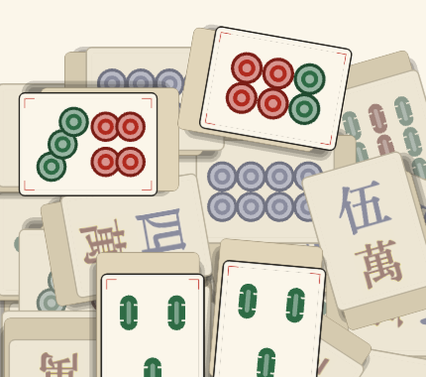

# S15 验收归档 · 关卡页排版重做 + 牌面任意角度

> 本轮用户诉求（原文）：
> 1. 关卡页面的麻将牌展示不好看，超出框了，调整下尺寸，美化一下排版；
> 2. 关卡内的麻将牌只有竖放和横放，要有各种角度才真实，比如 45 度角、30 度角、27 度角等各种角度。

---

## 一、S15.1 关卡页卡片：尺寸与排版

### 病根（不是"看着挤"，是**必然越框**）

牌的**视觉**高度不是牌体高：立体厚牌在牌体盒子之外还有侧壁（向下）和投影（右下）。
旧的 `CARD_TILE_W = 108`：

```
牌体高 = 108 × (176/132) = 144
视觉高 = 144 + 下溢 22  = 166
卡高   = 158
        → 必然越框 8px（下边还额外压掉圆角）
```

旧版之所以"只是有点挤"，是因为厚度壁的米色很接近卡片底色，
越出去的那一截被眼睛当成了"卡片的底边阴影"。

### 改法

| 常量 | 旧 | 新 | 理由 |
|---|---|---|---|
| `CARD_TILE_W` | 108 | **90** | 视觉高 138 < 卡高 166，上下各余 14 |
| `CARD_H` | 158 | **166** | 一排总高 728 → 742（上下各多占 7px，仍有余量） |
| `CARD_GAP` | 32 | **26** | 补回卡片本身的高度 |
| `CARD_TILE_X` | -192 | **-196** | 牌位左移，给右侧留出呼吸 |
| `CARD_DIV_X / CARD_DIV_H` | — | **-122 / 104** | **新增**：牌位与文字之间的墨线分隔（透明度 26/255） |
| `CARD_TEXT_X` | -126 | **-98** | 文字左边界跟着墨线走 |
| `CARD_NAME_DY / CARD_SUB_DY` | 28 / -18 | **26 / -24** | 文字块整体重新居中 |

另外：`LevelSelectPage` 里代表牌改为**按视觉框居中**（`tileVisualBox`），
而不是按牌体居中 —— 立体装饰几乎全长在牌体盒子**之外**，
按牌体居中会让牌看着整体偏上。

### 验收




四张卡的牌（含侧壁 + 投影）全部落在卡内，上下留白各约 13px；
牌/文之间有墨线分区；四张卡的牌位、墨线、文字块完全对齐。

---

## 二、S15.2 牌面任意角度

### 设计

角度 = **基础朝向** + **偏斜**，两段分开抽：

```ts
ROTATION: {
    BASE: [0, 90, 180, 270],                       // 控"横竖各占多少"
    SKEW: [[0,55], [5,12], [10,9], [16,7], [24,6], [33,6], [45,5]],  // 控"歪得有多野"
}
```

- **为什么不直接 0~360 自由随机**：读牌是玩法前提。整堆牌里 1/3 是倒着的，
  玩家会先骂娘。
- **为什么 0° 权重给到 55**：现实里牌堆也是"大半摆得挺正"的。
  0 档权重太低会让整堆看起来像被搅过一遍，而且可点牌数会掉。
- `rollAngleParts()` 里**符号永远抽一次**（即使 skew=0 也抽完丢掉）——
  这是为了让随机数的**消耗次数与档位无关**，
  否则 A/B 两批牌局从第一张起就不同，对照实验里混着"换了布局"的噪声。

### 渲染

`TileView` 直接吃 `node.angle`（Cocos 口径：屏幕坐标 y 向上、顺时针为正）。
不需要改渲染层，牌体 + 牌面 + 立体侧壁整体一起转。





---

## 三、S15.3 / S15.4 连锁改动（角度不是免费的）

牌一旦能歪，"轴对齐包围盒"这条旧假设会在**三个地方**同时崩掉：

| 位置 | 旧口径 | 为什么 45° 时崩 | 新口径 |
|---|---|---|---|
| 遮挡判定 `buildBlockGraph` | AABB 相交（`|dx| >= hw1+hw2`） | 45° 的 AABB 面积是牌的 **2.4 倍**，虚出来的四角会与四邻"相交"→ 凭空造出大量假遮挡 → 可点牌骤减 → 开局长得像死局 | 先 AABB 粗筛，再过**分离轴定理** `obbOverlap` 精判 |
| 命中测试 `hitStackTile` | 点在 AABB 内 | 会点中"牌没画到、但包围盒盖住了"的空角落 | `pointInTile`：把点逆变换回牌的局部坐标再判 |
| 边界/网格 `resolvePositions` | 按牌宽高算占位 | 歪牌会捅出牌堆区 | **`fitAngle`**：按档位从大到小试，第一个"放得下"的就用 → 贴边的牌**自己收一点偏斜**（符合"靠边的牌被挤得摆正些"的直觉）；只有连基础朝向都放不下才挪位置 |

配套：**网格容量完全按正立牌算**（`gridExtent`）—— 按最坏角度算会让列数 5→4、
格点 40→28（-30%），不划算；正确性由 `fitAngle` 兜底。

### 顺带修掉两个真 bug

1. **`resolvePositions` 逐行错位的左右边界写反**（本轮最大发现）

   ```ts
   // 旧（错）：用最右列算左边界、最左列算右边界
   const lo = Math.max(-nominal, safeL - grid.xOf(maxC));
   const hi = Math.min(nominal,  safeR - grid.xOf(minC));
   ```

   约束退化成两条永远成立的不等式 → 每行都能偏移满 ±0.3 格 →
   最边上的牌被逐张夹回边界 → **同行相邻牌间距从 140px 压到 119px
   （< 牌宽 128）→ 两张牌重叠**，破掉"同行相邻不许互相压"这条硬约束。
   表现：教学关 12 张里有 1 张被压住、开局点不动，**不报错、不崩**。

   修复后 P0 档（纯正立）从 `遮挡边数 1 / 同行相交 1` → **`0 / 0`**。

2. **`depthOfCell` 同层同行同叠号深度相等** → 遮挡判定（严格大于才压住）判"不压"。
   旧版无害（横向格距 > 牌宽），但 S15 歪牌后同行相邻必然相交，
   会出现"两张叠着却都能点"。补上**列号末序**（左上压右下，与阴影方向一致）。

---

## 四、无头探针（四档位对照）

`probe/probe-s15.ts` —— 4 套档位 × 4 关 × 12 局，**同一批 seed**。
完整输出见 `probe/probe-final.log`。

档位定义：P0 纯正立 / P1 四向（S14 旧版）/ **P2 当前档** / P3 收敛档（砍掉 36~45°）。

关键结论：

| 指标 | 结果 |
|---|---|
| **越界张** | 四档位 × 四关**全部为 0**（最大越界 ≤ 0.5px）→ `fitAngle` 生效 |
| **网格容量** | `试手气 4×3=12 / 上道了 5×8=40 / 有点意思 5×7=35 / 就差一点 5×7=35`，与 S14 一致，**没有因角度回退** |
| **P0 档（纯正立）** | 遮挡边数 0、同行相交 0 → 证明边界 bug 已修 |
| **偏斜分布（P2）** | 0°: 58~63%，1-8°: 10~13%，9-20°: 10~17%，21-35°: 7~12%，36-45°: 3~6% |

**L4「就差一点」认证可解 0/12 是 S14 就有的旧账，不是本轮引入的**：
P1（S14 四向旧版）在 L4 同样是 0/12，P2/P3 也是 0/12。
把它从 0/12 救回来的是 **P0（纯正立，8/12）** ——
也就是说，吃掉 L4 可解性的是**四向朝向**（横躺牌）而不是本轮的偏斜。
（已知遗留：`#50 T6 量化验证`／S5 难度重标定会处理 L4 的牌堆密度与失败感。）

---

## 五、档位待拍板

P2（当前档）与 P3（收敛档）的差别只在 **36~45° 这一档**：

- **P2**：保留，占比 3~6%。观感最接近用户原话里的"45 度角"。
- **P3**：砍掉，最大偏斜 33°。整堆更清爽、可读性更好。

两档在开局可点、认证可解、重采样、遮挡边数上**差异都在噪声内**（见 probe-final.log），
所以这是一个**纯观感**的选择，等用户看截图拍板。

---

## 六、复现命令

```bash
# 类型检查
bash tools/tscheck.sh game-4-mahjong

# 无头探针
bash docs/verify/S15/probe/sync.sh
cp docs/verify/S15/probe/probe-s15.ts /tmp/s10-probe/
cd /tmp/s10-probe && node --experimental-transform-types --no-warnings probe-s15.ts

# 截图
bash tools/cocos-build.sh web-desktop debug game-4-mahjong
bash tools/smoke-run.sh web-desktop /tmp/s15-L2 "unlock:4" "d:0,-118" "wait:1500" "d:0,83"  "wait:3000"
bash tools/smoke-run.sh web-desktop /tmp/s15-L4 "unlock:4" "d:0,-118" "wait:1500" "d:0,-301" "wait:3500"
```
