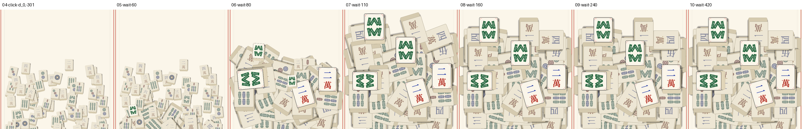
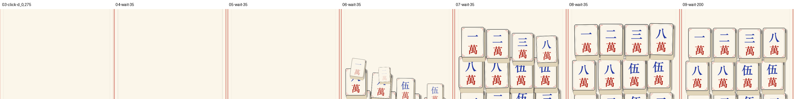

# S16 验收归档 · 菜单页压字修复 + 入场改「涌现」

> 本轮用户诉求（原文）：
> 1、进入页面的麻将变得立体后，遮挡了文字，也要进行优化；
> 2、每一关开局时，麻将牌不要用飞入的方式，改成抓大鹅那种从底部涌现，就像蘑菇一样喷涌出来的方式，更有动感。

---

## 一、S16.1 菜单页：立体牌的侧壁盖住了说明文字

### 病根（和 S15 关卡页「越框」是同一类病）

牌做成「立体厚牌」之后，**纵向占位 ≠ 牌体高**。牌的视觉框 = 牌体 + 立体装饰
（侧壁向下 27px、投影右下 15px，见 `CFG.SOLID_OVERHANG` / `tileVisualBox`）。

```
旧 SHOWCASE_TILE_W = 120
  视觉高 = 牌体 160 + 下溢 24.5 = 184.5
  牌中心 SHOWCASE_Y = 106  →  视觉下沿 = 106 − 80 − 24.5 = 1.5
  而三族说明文字 CAPTION_Y = 4，字的上沿在 4 + 11 = 15
  →  整行字落在牌的侧壁里，被盖住
```

而「分隔线 216 → 主按钮上沿 −48」这段纵向预算只有 **264px**，还要塞下说明文字的一行（约 30px）。
用 120 宽时 184.5 + 30 = 214.5，只剩 49.5 分给三段间距 → 每段 16px，必然挤在一起。

### 改法（全部在 `CFG.MENU_LAYOUT`）

| 常量 | 旧 | 新 | 理由 |
|---|---|---|---|
| `SHOWCASE_TILE_W` | 120 | **104** | 视觉高 184.5 → **159.9**，腾出 24.6px |
| `SHOWCASE_Y` | 106 | **122** | 视觉上沿 191.3（离分隔线 24.7），下沿 31.4 |
| `CAPTION_Y` | 4 | **-7** | 字上沿 4，离牌下沿 **27.4** |

改后三段间距：**分隔线→牌 25 / 牌→说明 29 / 说明→按钮 31**（实测像素，见下）。

### 验收（`截图/01-菜单页-S16.1修复后.png`）

对 720×1280 渲染逐行扫描深色像素，实测：

| 界标 | 屏幕 y |
|---|---|
| 分隔线 | 424 |
| 三张牌视觉上沿 | 449 |
| 三张牌视觉下沿（含侧壁 + 投影） | 607 |
| 说明文字字墨 | 636 – 657 |
| 主按钮上沿 | 688 |

说明文字**完整可见**，上不压牌、下不压按钮。

---

## 二、S16.2 入场：从「天上撒下来」改成「从地里长出来」

### 设计（`CFG.MOTION` 第十六节，`FLY_IN*` → `SPROUT*`）

| 参数 | 值 | 理由 |
|---|---|---|
| `SPROUT_IN` | 0.42s | 单张从土里长到落位的时长（比飞入 0.34s 略长：生长是"顶"出来的，不是"砸"下来的） |
| `SPROUT_FROM_RATIO` | 1.2 | 起点在目标**正下方**，距离 = 这张牌的牌高 × 1.2。**用比例而非固定像素** —— 牌面尺寸随关卡变（L1 牌宽 128、L2 起 106.25），固定像素在 L1 是半个牌高、在窄牌关却是两个牌高 |
| `SPROUT_SCALE_FROM` | 0.42 | 起始缩放。**只位移不放大就只是"平移"**，读不出"长出来" |
| `SPROUT_SPREAD_X` / `SPROUT_ANGLE` | ±34px / ±15° | 比旧版（±96px / ±24°）小得多：喷涌是**原地冒**，不是横向飞 |
| 曲线 | `backOut` | 过冲后回位 = "顶出土"的弹性 |
| **错峰** | **按田垄：牌按屏幕 y 自下而上分带** | 与"撒牌"最大的分野（见下） |
| `SPROUT_BAND_GAP` | 0.075s | 相邻两垄的间隔，决定"生长波"快慢 |
| `SPROUT_SWEEP_X` | 0.06s | 同一垄内最左↔最右的先后差，给整齐的生长加一点"风" |
| `SPROUT_BAND_MAX` | 6 | 带数 = 牌堆纵向跨几个牌高；封顶避免"最后一垄等到入场快结束才冒头" |
| `SPROUT_TOTAL_MAX` | 1.0s | 牌多/垄多时压缩垄间距，而不是把入场拉长到 2 秒 |
| `SPROUT_SQUASH` | 0.12s | 落位挤压（复用 `SQUASH_X/Y`） |
| `SPROUT_LAND_GAP_MS` / `GAIN` | 110ms / 0.42 | 落位音效节流。96 张牌不节流会糊成白噪声 |

**为什么错峰不能沿用"深度升序"**：深度序回答的是"谁压着谁"，与牌在屏幕上的高低无关。
按它错峰，牌会在**随机高度**零星冒出，像被人从上面撒下来的；按 y 分带之后，
最先冒的是最下面那"一垄"，然后逐垄往上 —— 蘑菇从地里成片顶出来就是这个节奏。
⚠️ **绘制顺序（`siblingIndex`）仍然按 `depth` 排**，这里只改先后，不动 z 序。

### 实测参数（`inst2.ts` 直接读 `generateLevel` 的输出算出来的）

| 关卡 | 张数 | 牌高 | y 跨度 | 垄数 | 起点下移 | 垄间距 | 总时长 |
|---|---|---|---|---|---|---|---|
| L1 试手气 | 12 | 171.7 | 369 | **3** | **206px** | 75ms | **750ms** |
| L2 上道了 | 36 | 142.5 | 511 | **4** | **171px** | 75ms | **825ms** |
| L3 有点意思 | 63 | 142.5 | 484 | **4** | 171px | 75ms | 825ms |
| L4 就差一点 | 96 | 142.5 | 466 | **4** | 171px | 75ms | 825ms |

### 验收（连拍）




- **L4**（96 张）：40 / 100 / 180 / 290 / 450 / 690ms 各一帧 —— 可清楚看到牌堆**自下而上长起来**，
  上半区先是空的，逐垄填满。
- **L1**（12 张）：1 / 36 / 71 / 106 / 141 / 176 / 376ms 各一帧 —— 底垄先落定（已是实色），
  第二垄还在半高、半透明，顶垄尚未冒头。

关键帧单图：`截图/04-L4-涌现关键帧-起.png`（起）、`截图/05-L1-涌现关键帧-中.png`（中）、
`截图/06-L4-落定.png`（落定）。

### 回归

`d:0,-118` → `d:0,275` → `auto:12`：**已清 6/12**，点击判定正常（日志见 `log/regress.log`）。
入场期间点击仍走输入缓冲（日志里会出现一次「暂时忙，等解锁后补做」），这是既有设计。

---

## 三、两个实现细节（都是"看起来像 bug"的坑）

1. **起始态必须在 `buildStack()` 里就摆好**，包括 **`scale`**。
   旧版飞入的起点在屏幕外 680px 处，看不见，所以起点缩放可以留到 `onEnter` 设；
   现在起点就在牌堆**正下方、画面里**，晚一帧设缩放就会看到"一堆大牌在下面闪一下"。
2. **入场兜底复位必须复位 `position` 与 `scale`**（不只是 `angle` / `opacity`）——
   否则 tween 一丢，那张牌**永久停在土里**（比旧版"停在屏幕外"更容易被看见）。
   铁律不变：复位走 `setTimeout`，不依赖 tween 回调。

---

## 四、复现命令

```bash
bash tools/tscheck.sh game-4-mahjong
bash tools/cocos-build.sh web-desktop debug game-4-mahjong

# 菜单页静帧
bash tools/smoke-run.sh web-desktop /tmp/s16-menu "wait:1200"

# L4 涌现连拍（注意：每个动作必须是**独立参数**）
bash tools/smoke-run.sh web-desktop /tmp/s16-L4 "unlock:4" "d:0,-118" "wait:1300" \
     "d:0,-301@40" "wait:60" "wait:80" "wait:110" "wait:160" "wait:240" "wait:420"

# L1 涌现连拍
bash tools/smoke-run.sh web-desktop /tmp/s16-L1 "d:0,-118" "wait:1300" \
     "d:0,275@1" "wait:35" "wait:35" "wait:35" "wait:35" "wait:35" "wait:200"

# 回归
bash tools/smoke-run.sh web-desktop /tmp/s16-regress "d:0,-118" "wait:1300" "d:0,275" "wait:1500" "auto:12"
```

> ⚠️ **CDP 截图本身有几十到几百毫秒的抖动**：同一串动作在不同次运行里抓到的动画相位会不一样。
> 连拍时**多抓几帧、间隔取够密**（35~80ms），别指望"某一帧一定落在某个时刻"。
